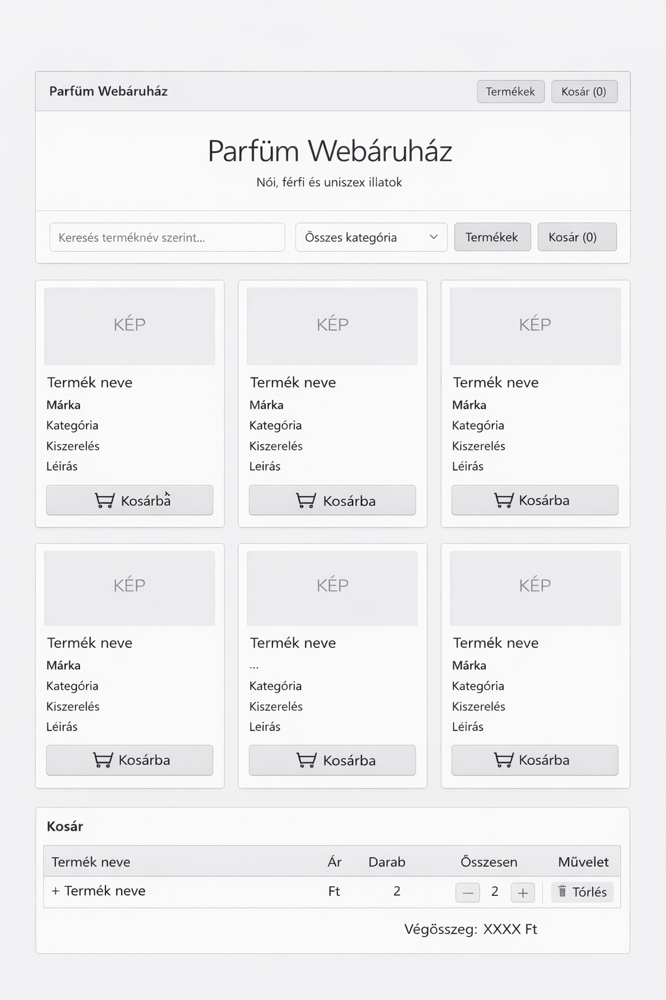
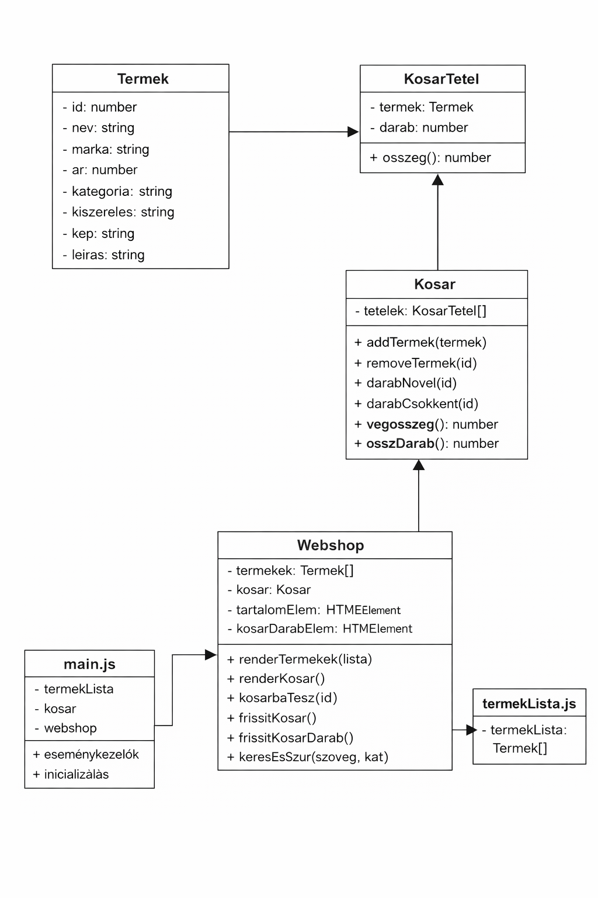

# 🛍️ Parfüm Webáruház (OOP)

## 👩‍💻 Készítette
- Ponauer Maja

---

## 📌 Projekt leírás

Ez a projekt egy egyszerű **webáruház alkalmazás**, amely parfümöket jelenít meg.  
Az alkalmazás **Single Page Application (SPA)**, tehát minden egy oldalon történik.

A felhasználó:
- böngészheti a termékeket
- kereshet név alapján
- szűrhet kategória szerint
- kosárba helyezheti a termékeket
- módosíthatja a darabszámot
- törölhet termékeket a kosárból

---

## ⚙️ Használt technológiák

- HTML
- Bootstrap 5
- JavaScript 
- Objektumorientált programozás

---

## 🧠 Funkciók

- ✅ Terméklista megjelenítése
- ✅ Keresés terméknév alapján
- ✅ Szűrés kategória szerint
- ✅ Termék kosárba helyezése
- ✅ Termék törlése a kosárból
- ✅ Darabszám növelése/csökkentése
- ✅ Azonos termékek darabszámának növelése (nem duplázódik)

---

## 🧾 Drótváz

---

## 🧱 Osztályok (UML)

---

## 🤖 AI használata

A projekt készítése során AI segítséget is igénybe vettem, azonban a program működését megértettem és a kódot saját magam alakítottam ki.